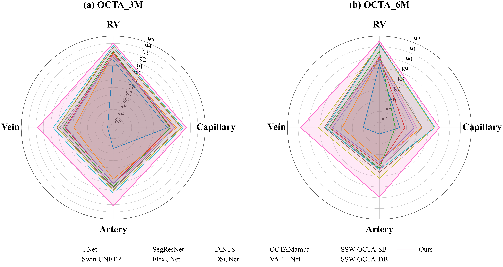
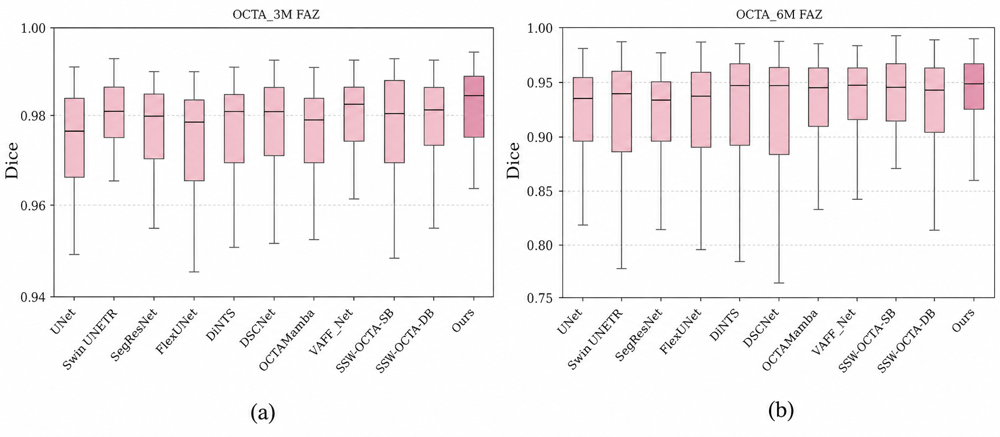

# USkelCtrlNet

Official implementation of **USkelCtrlNet: Skeleton-Free Structural Credibility Modeling for Topologically Accurate OCTA Segmentation**.

USkelCtrlNet is a PyTorch framework for OCTA vessel and FAZ segmentation. It improves topology-aware segmentation by introducing skeleton-free structural credibility modeling inside the network.

<p align="center">
  
</p>

## Highlights

- Skeleton-free structural credibility modeling for OCTA segmentation.
- Reliability-gated feature calibration and decoder refinement.
- Multi-view direction-aware deformable convolution for vessel-like local structures.
- Deformable Swin-style attention for local continuity and long-range context.
- Evaluation with overlap, surface, connectivity, and topology-sensitive metrics.
- Supports OCTA-500 3M and 6M segmentation settings.

## Results

The figures below summarize OCTA-500 performance for vessel-related tasks and FAZ segmentation.

<p align="center">
  
</p>

<p align="center">
  
</p>

## Repository Layout

```text
.
|-- assets/figures/              # Framework and result figures used in this README
|-- datasets/OCTA-500/           # OCTA-500-style data directory
|-- models/USkelCtrlUnet.py      # USkelCtrlNet model definition
|-- conversion_and_visualize.py  # Convert saved prediction arrays to visual results
|-- dataset.py                   # OCTA-500 dataset and split loader
|-- loss_functions.py            # Dice, clDice, edge, connectivity, and OHEM losses
|-- metrics.py                   # Region, surface, connectivity, and topology metrics
|-- options.py                   # Training arguments
|-- train.py                     # Training and evaluation entry point
|-- requirements.txt             # Reproducibility dependencies
`-- README.md
```

## Environment

Create a Python 3.10 conda environment. The recommended environment name is `uskelctrlnet`; if you prefer your original naming convention, replace it with `gjd38`.

```bash
conda create -n uskelctrlnet python=3.10 -y
conda activate uskelctrlnet
pip install -r requirements.txt
```

If your CUDA version requires a specific PyTorch build, install `torch` and `torchvision` from the official PyTorch selector first, then install the remaining packages from `requirements.txt`.

## Data Preparation

The code expects OCTA-500 projection maps and binary labels under `datasets/OCTA-500`. A small OCTA-500-style sample tree is included for checking paths and file format, but full reproduction requires the complete OCTA-500 dataset.

Expected 2D layout:

```text
datasets/OCTA-500/
|-- 3M/
|   |-- ProjectionMaps/
|   |   |-- OCTA(FULL)/
|   |   |-- OCTA(ILM_OPL)/
|   |   `-- OCTA(OPL_BM)/
|   |-- GT_LargeVessel/
|   |-- GT_Capillary/
|   |-- GT_Artery/
|   |-- GT_Vein/
|   `-- GT_FAZ/
`-- 6M/
    `-- same structure
```

The default input uses three OCTA projection layers: `FULL`, `ILM_OPL`, and `OPL_BM`.

## Training

Example command for the 6M large-vessel/RV task:

```bash
python train.py \
  -device 0 \
  -fov 6M \
  -label_type LargeVessel \
  -model_name USkelCtrlUnet \
  -epochs 100 \
  -batch_size 1
```

Supported `label_type` values:

```text
LargeVessel, Capillary, Artery, Vein, FAZ
```

The current loader uses the following OCTA-500 index splits:

| FOV | Train | Validation | Test |
| --- | ---: | ---: | ---: |
| 3M | 0-139 | 140-149 | 150-199 |
| 6M | 0-179 | 180-199 | 200-299 |

Training outputs are written to `results/<timestamp>/<configuration>/`, including checkpoints, `metrics_statistics.xlsx`, per-sample test CSV files, and saved prediction arrays.

## Visualization

`conversion_and_visualize.py` converts saved `.npy` prediction outputs into overlay images. In the current script, set `SRC_DIR`, `DST_DIR`, and `LABEL_TYPE` near the bottom of the file, then run:

```bash
python conversion_and_visualize.py
```

## Reproducibility Notes

- Random seeds are set in `train.py` from `-seed`.
- cuDNN deterministic mode is enabled in `train.py`.
- The default evaluation threshold is `--eval_thr 0.5`.
- Use the complete OCTA-500 dataset and the split above for experiment-level reproduction.

## Acknowledgements

This implementation builds on PyTorch, MONAI, torchvision, OpenCV, Albumentations, scikit-image, and related scientific Python tooling.
